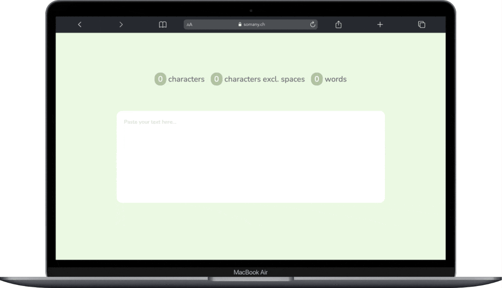

# So Many Characters!

## Overview

This Vue.js application allows users to analyze text input, providing information about the character count, character count excluding spaces, and word count. The user interface is designed for simplicity and ease of use.

## Context 

If you frequently handle textual content, monitoring its length is important. In marketing, adhering to specified character limits in SMS advertisements is crucial to prevent unnecessary costs. And if you oversee a team of content creators and compensate them based on character count, estimating their workload becomes a routine necessity.

While Google Docs offers a word count feature, the process involves multiple steps: logging in, creating a document, pasting the text, and then utilizing the word count function.

Having followed this method for almost 15 years, I, as a web developer, have the liberty to craft more efficient tools. I've designed an app named 'So Many Characters,' dedicated exclusively to character and word counting. Visit [somany.ch](https://www.somany.ch) on your computer, paste text of any size, and promptly acquire precise character and word counts.

Developed with Vue.js and hosted on Netlify, 'So Many Characters' strives to simplify this essential task for users, offering a swift and hassle-free solution for evaluating text length.

## Features

- Character Count: The app displays the total number of characters in the input text.
- Character Count Excluding Spaces: It provides the character count, excluding spaces.
- Word Count: The app calculates and displays the total number of words in the input text.

## Usage

To use the app, follow these steps:

1. **Access the App:** Open your web browser and navigate to [somany.ch](https://www.somany.ch) on your computer.

1. **Input Text:** Paste or type your text in the provided textarea.

2. **Character and Word Count:** The app shows real-time counts for total characters, characters excluding spaces, and words.

## Technologies Used

This app is built using Vue.js, a progressive JavaScript framework for building user interfaces. It leverages modern web technologies for styling.

### Styling

The app uses the Nunito and Noto Sans fonts from Google Fonts for a clean and readable interface.

## Installation

No installation is required to use this app. Simply access it through your web browser using the provided URL.

## License

This project is licensed under the MIT License.
